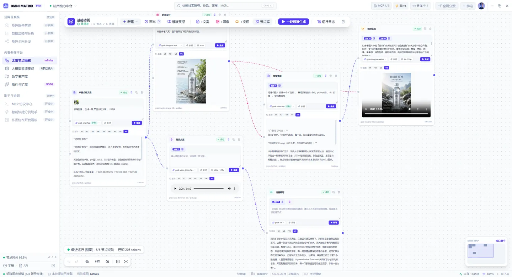
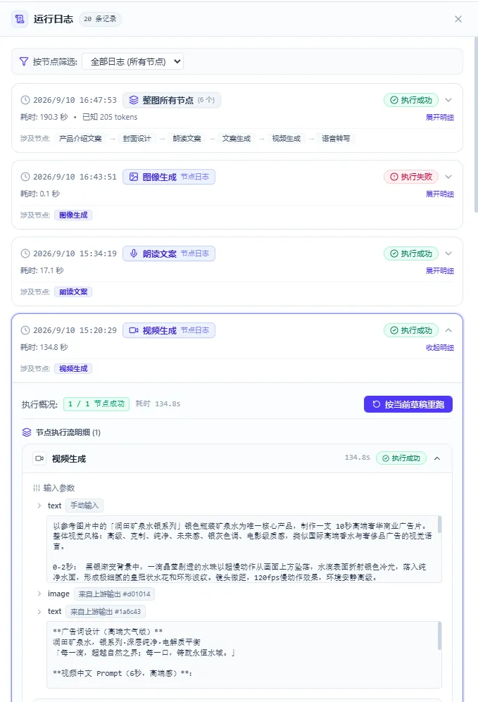
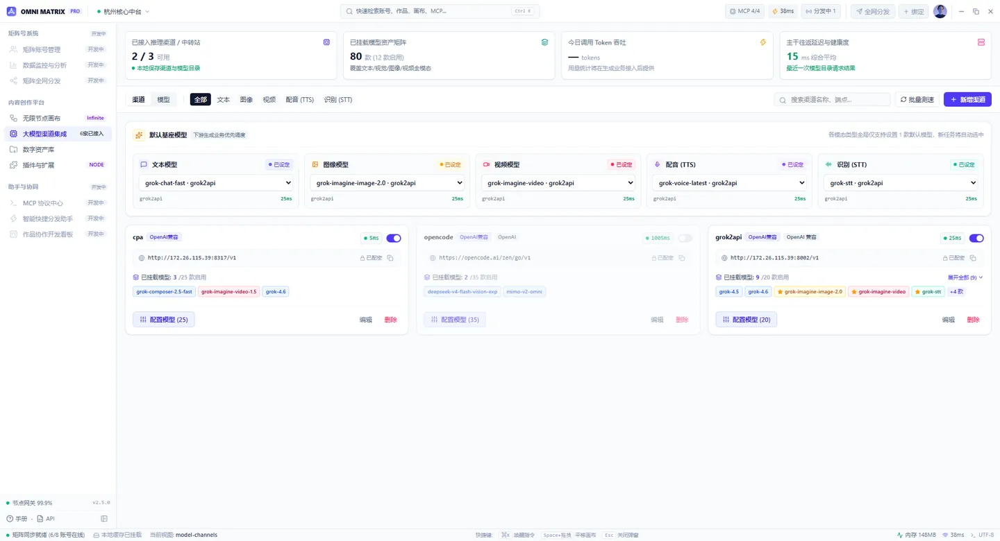
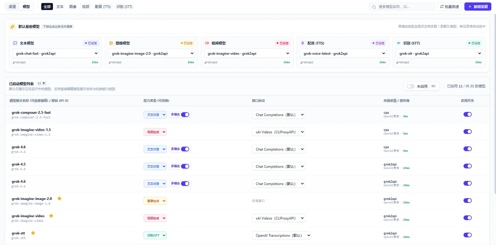
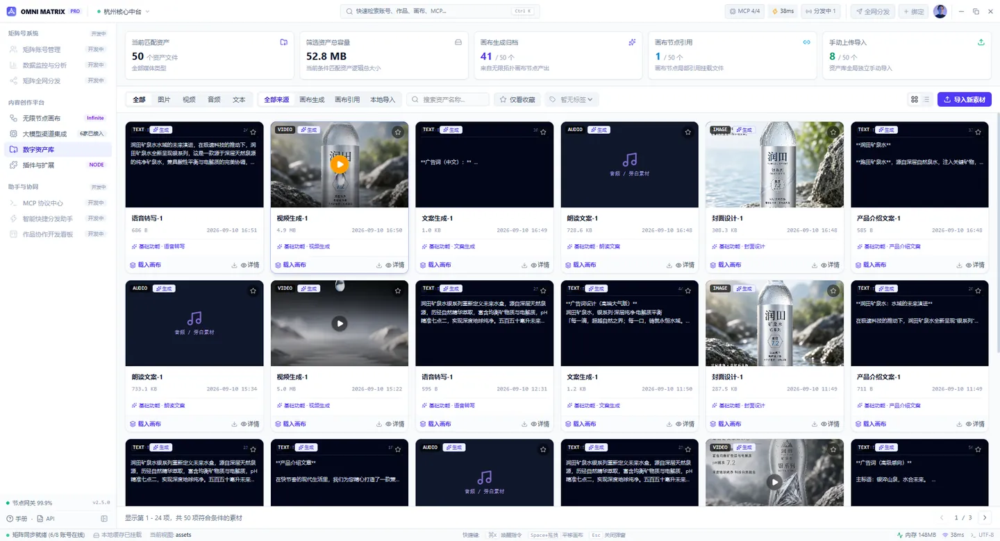
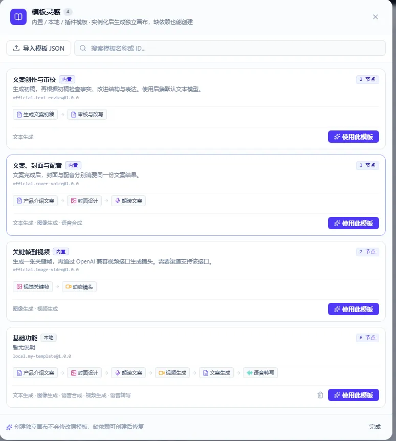
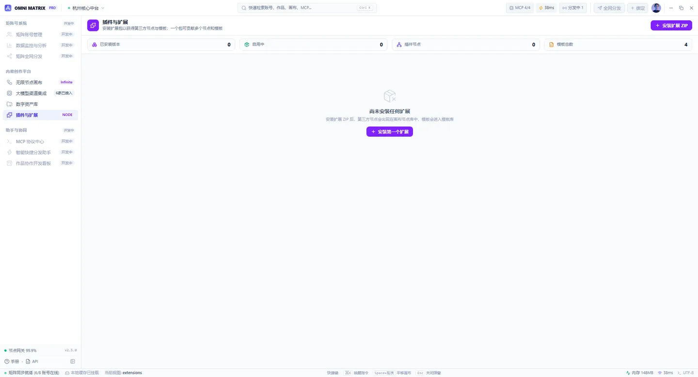

# XCode One

本地优先的 **AI 内容创作中台**：用无限节点画布把文案、图片、音频、视频串成一条流水线，接入你自己的大模型渠道，一键顺推生成，并沉淀到数字资产库。

本仓库托管安装包发布、画布模板、节点库、Skills，以及产品 Issue。安装包见 [Releases](https://github.com/zhujiane/xcode.one/releases)（二进制不提交进 git）。

  

<em>一条画布跑通「文案 → 封面 → 口播 → 视频 → 转写」，6/6 节点成功，本轮消耗 205k tokens</em>

---

## 适合谁

- 要把「产品卖点 → 文案 / 海报 / 口播 / 短视频」一次编排出来的创作者与运营
- 需要同时挂多家模型、按模态设默认模型的团队
- 希望素材、运行记录、密钥留在本机，而不是散落在多个网页后台的人

---

## 核心能力

### 无限节点画布

在一张无限画布上搭建多模态工作流：文案节点产出卖点与脚本，下游可接到海报设计、口播配音、视频成片、语音转写等节点；连线表达依赖，「一键顺推」整图跑通，也可针对目标节点局部生成。

- 节点状态与用量可见：每次候选结果标注耗时与 token，底部汇总本轮成功率
- 运行过程可看实时日志，支持取消；长任务（如视频）可按原远端任务恢复，避免重复提交
- 画布草稿与正式运行版本分离，历史候选（V1/V2/V3…）可固定给下游，改提示词不会悄悄污染已定稿链路
- 画布内直达模板灵感与节点库，新流程快速起盘

### 运行日志与追踪

  

- 整图 / 单节点两级记录：时间、耗时、成功或失败、涉及节点
- 展开「节点执行流明细」，查看每个输入参数及其来源（手动输入 / 上游输出）
- 支持按当前草稿重跑，失败节点可快速重试

### 大模型渠道集成

统一管理推理渠道与模型资产矩阵：

  

- 支持 OpenAI 兼容等多种协议，可接自建 / 中转 / 官方端点
- 渠道启停、已挂载模型数与延迟一眼可见，支持批量测速
- 文本 / 图像 / 视频 / 配音（TTS）/ 识别（STT）分别配置默认基座模型，新任务自动选中
- 模型目录可同步；展示名称、能力类型、接口协议可切换，别名与启停可管
- API Key 加密保存在本机，界面不回显明文

  

### 数字资产库

生成结果自动归档，也可手动导入素材：

  

- 按类型筛选：图片 / 视频 / 音频 / 文本
- 按来源筛选：画布生成、画布引用、本地导入，支持仅看收藏
- 支持搜索、详情、载入画布，方便二次创作与复用

### 画布模板与插件扩展

- **模板灵感**：内置 / 本地 / 插件模板，卡片直接展示节点链路与能力类型，一键使用；支持导入模板 JSON
- **插件与扩展**：安装扩展 ZIP，获得第三方节点与模板；节点进入画布节点库，模板进入模板库

  

  

### 矩阵号与分发（建设中）

侧栏预留矩阵号管理、数据监测、全网分发等能力，用于多账号运营与投放；相关入口仍在建设中，主路径以画布创作 + 渠道 + 资产库为准。

### 助手与协议（建设中）

- **MCP 协议中心**：对接 MCP，扩展工具与上下文能力
- **智能分发助手**、**作品协作开发看板**等辅助能力，缩短从成片到投放的路径

### 开放资源（本仓库）

| 目录 | 用途 |
| --- | --- |
| [`canvas-templates/`](./canvas-templates/) | 可分享的画布 JSON（`schemaVersion: 1`） |
| [`node-library/`](./node-library/) | 开放节点描述 |
| [`skills/`](./skills/) | 可复用操作技能 |

贡献方式见 [CONTRIBUTING.md](./CONTRIBUTING.md)。

---

## 优势一览

| 优势 | 说明 |
| --- | --- |
| 一条画布跑完全链路 | 文案 → 图 → 音 → 视频同屏编排，减少多工具来回拷贝 |
| 模型自己带 | 不绑死单一厂商；多渠道、多模态默认路由 |
| 本地可控 | 工作流、资产、密钥在本机；渠道凭证加密存储 |
| 结果可沉淀 | 生成即进资产库，可筛选、复用、再载入画布 |
| 运行可追踪 | 节点状态、日志与 token 用量可见，长任务可恢复 |
| 可扩展 | 模板 JSON + 扩展 ZIP，节点与模板都能外挂 |

---

## 快速开始

### 1. 安装

1. 打开 [Releases](https://github.com/zhujiane/xcode.one/releases)
2. 按系统下载 Windows Setup / macOS dmg / Linux AppImage（或 deb）
3. 安装并启动

若暂无安装包，说明公开发布还在准备中，可先 Watch 本仓库或提 Issue。

### 2. 配置渠道

打开 **大模型渠道集成** → 新增渠道，填写协议、Base URL（含版本路径，如 `/v1`）、API Key → 保存并同步模型目录 → 在「默认基座模型」为文本 / 图 / 视频 / 语音 / 识别设定默认模型。

### 3. 搭一条画布

进入 **无限节点画布** → 添加节点并连线（例如：产品介绍文案 → 海报设计 / 口播文案 → 视频成片）→ 保存草稿 → **一键顺推生成**；也可从 **模板灵感** 直接套用内置链路。

在运行面板查看各节点成功与否及用量；满意的结果可固定给下游。

### 4. 管理资产

打开 **数字资产库**，按类型或来源筛选；需要时「载入画布」或导入本地素材继续创作。

### 5. 使用模板与扩展（可选）

- 从 **模板灵感** 使用内置模板，或导入 [`canvas-templates/`](./canvas-templates/) 中的 JSON
- 从 **插件与扩展** 安装扩展 ZIP，获得第三方节点与模板

模板里不要带密钥、私有模型 ID、本地资产 ID 或运行历史。

---

## 反馈

Bug 与功能建议请开在本仓库 [Issues](https://github.com/zhujiane/xcode.one/issues)。

提交模板 / 节点 / Skills 前请去掉密钥与个人路径，详见 [CONTRIBUTING.md](./CONTRIBUTING.md)。
